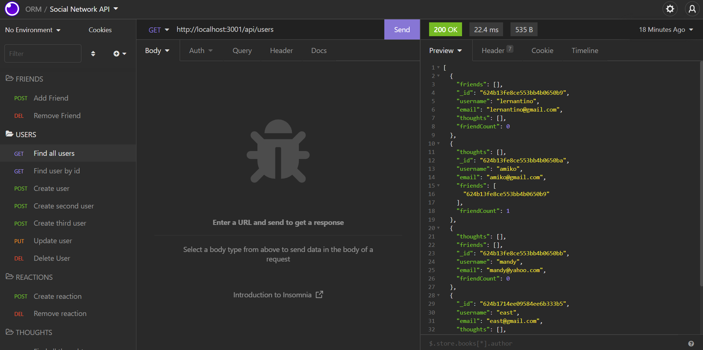

# social-network-API
 
## Description 
This project is an API for a social network web application where users can share their thoughts, react to friends' thoughts, and create a friend list. 
I used Express.js for routing, a MongoDB database, and the Mongoose ODM. 
## Usage
Users can run the command to start it up: 

`1. node utils/seed.js` 

`2. node index.js` 

## Screenshot
 

## Links

<a href="https://drive.google.com/file/d/1MoT4UwAyFsC-6o8KqYfNQnmh9BON0qLa/view?usp=sharing">Link to the walkthrough video</a>

<a href="https://github.com/Yanbud/social-network-API">Link to the code repository</a>

## License
This project is licensed under the MIT license.
